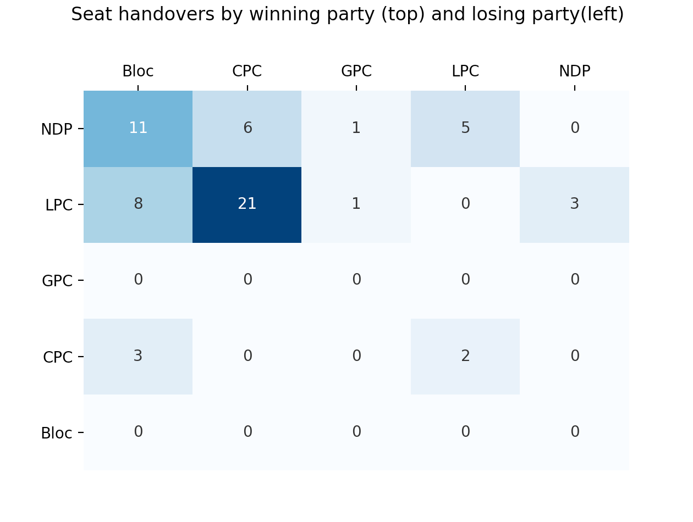

# 2015-19 Canadian Federal Election Data and Simple Analysis
Easy to use .csv results for the 2015 and 2019 Canadian Federal Elections and some simple insights from the data. Used to generate the visualizations in the blogpost (A few things you didn't know about the 2019 Canadian Election)[https://medium.com/@garethmacleod/a-few-things-you-didnt-know-about-the-2019-canadian-election-59ed848da6f5].

## Data
Elections Canada provides summary data for elections in .csv formats, but the schema isn't consistent from year to year and contains a lot of duplication. You can get the retrieve these files yourself from elections Canada, or use the copies we've stored here.

- `data/elections_data_2015.csv` retreivable from Elections Canada [here](https://www.elections.ca/content.aspx?section=res&dir=rep/off/42gedata&document=summary&lang=e)
- `data/elections_data_2019.csv` retrievable from Elections Canada [here](https://enr.elections.ca/National.aspx?lang=e)

The `data_operations` module contains functions to clean up and standardize this data. We've also pre-generated two csv's with this the standardized data in them so you don't have to do this everytime.

- `data/parsed_ridings_data_2015.csv`
- `data/parsed_ridings_data_2019.csv`

## Analysis

Most of the functions for creating the visualizations in the blogpost are in `analysis.py`. My workflow for this project has to load this file directly into an ipython shell with `ipython -i analysis.py`. You'll find the 2015 and 2019 election data is pre-loaded into dataframes named `df42` and `df43` respectively.

## Further work

The riding-by-riding data on it's own is a very lightweight dataset. Some other interesting research directions would be:
* Stage the poll-by-poll data that Elections Canada provides, combine it with demographic or economic data to look for patterns.
* Stage the data from earlier elections and look for decades-long patterns. This will take a bit of intelligence since there was a redistricting before 2015.
